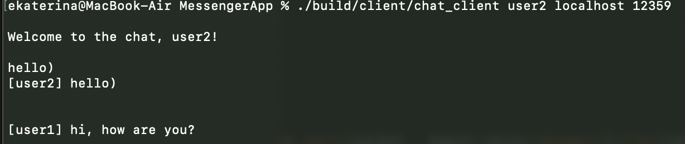

# MessengerApp

### Features
* Multi-client Support: Handles multiple client connections concurrently.

* Real-time Messaging: Clients can send and receive messages instantly.

* Basic Error Handling: Includes basic error handling for network operations.

### Requirements

* C++ compiler that supports C++20 or later.

* Boost library (specifically Boost.Asio) installed.


### Compilation and assembly
```
mkdir build
cd build
cmake ..
cmake --build .
./build/client/chat_client <username> <port> 
./build/client/chat_server <port>
```

### Example:

